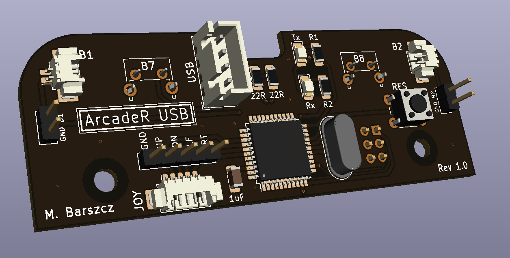
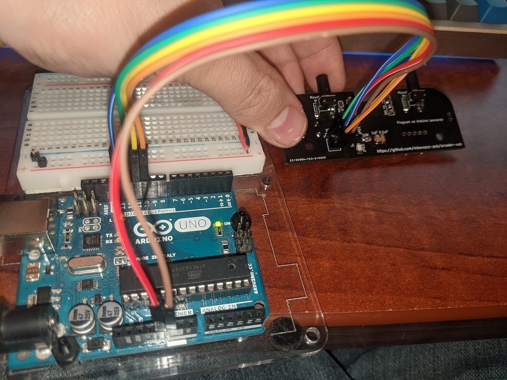
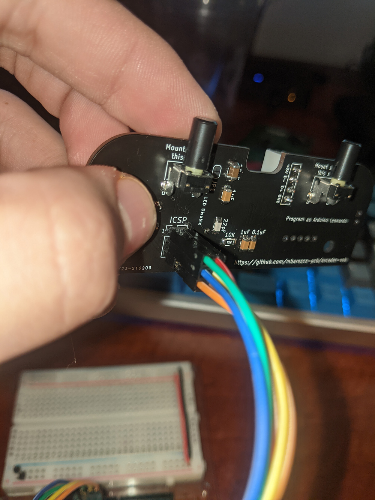
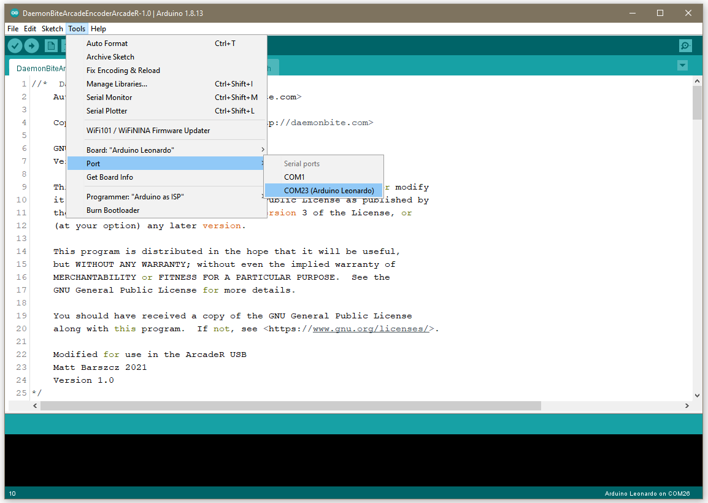
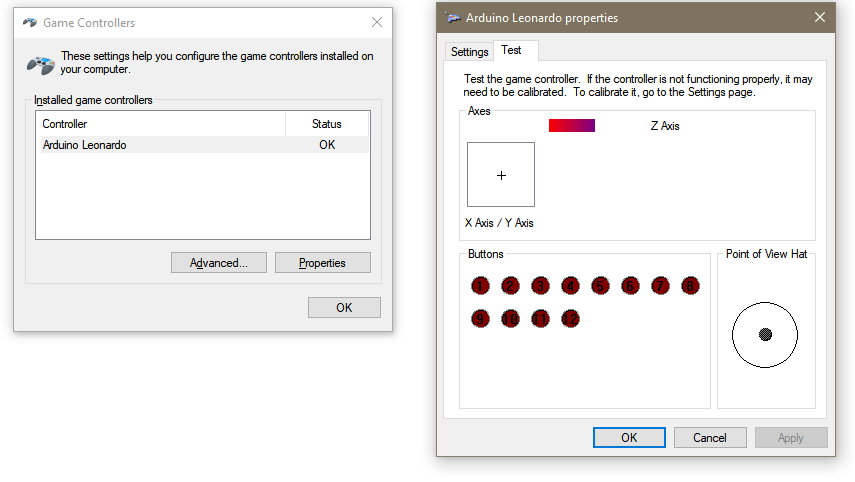

# arcader-usb
Replacement PCB that brings USB connectivity to the Retroradionics ArcadeR Joystick

Quick Links
* [Schematic](pdf/arcader-usb-1.0-schematic.pdf)
* [Gerber Files](gerbers)
* [PCB Renderings](images/pcb)
* [Photos](images/photos)

## Introduction
The ArcadeR USB is an open source PCB project with firmware based on the open source [DaemonBite Arcade Encoder](https://github.com/MickGyver/DaemonBite-Arcade-Encoder) and circuit design based on the Arduino Leonardo.  The original PCB inside the ArcadeR output provided Atari/Amiga/C64 style outputs through a DB9 connector.  While the DB9 connector is great for retro computers and consoles, using the ArcadeR with a PC, Raspberry Pi, or MiSTER requires external adapters.  Moreover, many of the inexpensive adapters introduced significant input latency, running the experience.

The ArcadeR USB aims to solve these problems plus introduces some extra features by simply providing a new PCB that fits inside the joystick with no modifications require and allows you to simply plug in the internal joystick and button cables.

## Features:
* DIY / Open Source
* Simple installation. Remove the screws, replace the PCB and cable, and plug everything back in
* Built around the Atmega32U4, Arduino Libraries, and DaemonBite firmware.  Use the firmware as-is or customize however you see fit
* Functions as a standard HID Gamepad, so no extra drivers required
* Replaces the two front latching switches with tactile switches wired as individually addressable buttons.  Now the front buttons can be used for Start/Select, Coin/Start, pressed together to bring up menus in emulation, or even used as an additional button in games
* Quickly link/unlink the two buttons on the fly with a simple button press.  Unlike with the original PCB, no opening of the case and rewiring of the buttons is required to link the two main buttons.  Simply press and hold the top two buttons for 1 second to link or unlink the buttons.  Now you can quickly switch between left and right handed use for 1 button games, or unlink the buttons and use them independently with arcade games that take advantage of both buttons.  The ArcadeR USB saves your last setting to the EEPROM of the Atmega32U4, so your buttons will stay linked or unlinked even after unplugging the controller.
* Designed with customization and DIY in mind.  With open firmware, Arduino library support, a standard Arduino ICSP header for reprogramming, and 2.54mm pin headers on the board for all button and joystick inputs, you can mix, match, rewrite, and reconfigure the ArcadeR to suit your needs
* Fits ready to use “Zero Delay USB Encoder” USB to JST-XH cables with built in strain relief or any other USB cable soldered directly to the 2.54mm headers.

## Bill of Materials (BOM)
* [Excel BOM](ArcadeR-USB-BOM.xlsx)

| Reference  | Type                   | Value  | Qty | Manufacturer               | Part #             | Digikey Part                | Description                                  | Sub Part      | Sub Digikey      |
|------------|------------------------|--------|-----|----------------------------|--------------------|-----------------------------|----------------------------------------------|---------------|------------------|
| U1         | Microcontroller        |        | 1   | Microchip                  | ATMEGA32U4RC-AU    | ATMEGA32U4RC-AU-ND          | Microcontroller                              | ATMEGA32U4-AU | ATMEGA32U4-AU-ND |
| J5         | Header                 | 2x3    | 1   | Amphenol ICC (FCI)         | 10129381-906002BLF | 10129381-906002BLF-ND       | 2x3 2.54mm Short Pin Header for ICSP         |               |                  |
| J11        | Connector              | 4      | 1   | JST                        | B4B-XH-A(LF)(SN)   | 455-2249-ND                 | JST-XH Header - 4 Contact (USB)              |               |                  |
| J21, J31   | Connector              | 2      | 2   | Molex                      | 0532610271         | WM7620CT-ND                 | Molex Picoblade 53261 - 2 Contact            |               |                  |
| J41        | Connector              | 5      | 1   | Molex                      | 0532610571         | WM7623CT-ND                 | Molex Picoblade 53261 - 5 Contact            |               |                  |
| SW3        | Tactile Switch         |        | 1   | TE Connectivity ALCOSWITCH | 1825910-6          | 450-1650-ND                 | Tactile Switch (Reset)                       |               |                  |
| SW7, SW8   | Tactile Switch         |        | 2   | E-Switch                   | TL1105JAF250Q      | EG1864-ND                   | Tactile Switch, Right Angle, Plunger for Cap |               |                  |
| SW7A, SW8A | Tactile Switch Cap     |        | 2   | E-Switch                   | 1RBLK              | EG1882-ND                   | Cap-Round                                    |               |                  |
| R1, R2     | 1206 Resistor          | 2.2K   | 2   | Stackpole Electronics Inc  | RMCF1206JT2K20     | RMCF1206JT2K20CT-ND         | 2.2K 1206 Resistor 5%                        |               |                  |
| R3, R4     | 1206 Resistor          | 22     | 2   | Stackpole Electronics Inc  | RMCF1206JT22R0     | RMCF1206JT22R0CT-ND         | 22R 1206 Resistor 5%                         |               |                  |
| R5         | 1206 Resistor          | 10K    | 1   | Stackpole Electronics Inc  | RMCF1206JT10K0     | RMCF1206JT10K0CT-ND         | 10K 1206 Resistor 5%                         |               |                  |
| D1, D2     | 1206 LED               | Amber  | 1   | Würth Elektronik           | 732-4988-1-ND      | 732-4988-1-ND               | Amber 1206 LED                               |               |                  |
| C1, C4, C5 | 1206 Ceramic Capacitor | 1uF    | 3   | KEMET                      | C1206C105K4RACTU   | 399-1254-1-ND               | 1uF Ceramic Capacitor 16V                    |               |                  |
| C2, C3     | 1206 Ceramic Capacitor | 22pF   | 2   | KEMET                      | C1206C220K3HAC7800 | 399-C1206C220K3HAC7800CT-ND | 22pF Ceramic Capacitor 25V                   |               |                  |
| C6         | 1206 Ceramic Capacitor | 10uF   | 1   | KEMET                      | C1206C106K4RACTU   | 399-3525-1-ND               | 10uF Ceramic Capacitor 16V                   |               |                  |
| C7         | 1206 Ceramic Capacitor | 0.1uF  | 1   | KEMET                      | C1206C104K4RACTU   | 399-9305-1-ND               | 0.1uF Ceramic Capacitor 16V                  |               |                  |
| Y1         | Crystal                | 16 MHz | 1   | TXC CORPORATION            | AS-16.000MAHK-B    | 887-1591-ND                 | 16 MHz Crystal - 20-22pF                     |               |                  |

* [Recommended "Zero-Delay USB Encoder" cable](https://focusattack.com/spare-4-pin-to-usb-cable-for-zero-delay-usb-encoder-pcb/).  Other USB cables can be used, but you may need to add a JST XH connector or strip the cable and solder the 4 wires directly to the PCB.

## Building the ArcadeR USB
Most of the build is pretty self explanitory, although there are a few things to keep in mind.

* For ease of use, I'd recommend buying can buying the USB cable designed for the Zero-Delay USB encoder.  This cable is inexpensive and comes with the correct JST XH connector already installed along with a strain relief.  You can use any USB cable though and crimp the JST connector on it, or omit the JST connector all together, and solder it directly into the 0.1" throguh holes on the PCB.

* The ICSP pin header is a tight fit in the joystick.  It is designed to be mounted to the bottom of the board, but ensure that you check fitment before soldering the pin header.  Depending on the length of your headers, you may need to "cheat" by pushing the header against a hard surface to make the pin length a bit shorter.  If need be, trim any excess length off the back of the pin header (top of the board) to preserve the bevel on the pin header.

* The reset button has proven to be unnecessary and can simply be omitted in most cases.  It is a tight fit under the right fire button.  While it does clear, care must be taken to ensure the connectors on the bottom of the fire button are not depressing the reset button when assembled.  I haven't had a use for it as the Arduino IDE can auto-reset the microcontroller over USB.  My recommendation would simply be to not solder it to the board and if a reset is needed, short the pads with a small pair of tweezers.

* I recommend installing the front facing right angle tactile switches into the PCB, fitting the PCB into the Arcader USB joystick housing, and then soldering 1 or 2 of the pins on the tactile switches in place.  This will ensure a nice straight fit on the front buttons.

* When you close up the case, make sure the cables aren't interfering with the closing of the case, fire button connectors, or the reset button.

## Programming the ArcadeR USB
Once the board has been assembled, you will need to program the microcontroller as an Arduino Leonardo and then load the firmware sketch. 

### Part 1 - Burn the Arduino Bootloader
The Atmega32u4 on the ArcadeR USB needs to be programmed as an Arduino Leonardo compatible device so it can be recognized and prorgrammed by the Arduino IDE.  This only has to be done once.  There are two ways to accomplish this:

1.  By using an AVR programmer such as this one from [Sparkfun](https://learn.sparkfun.com/tutorials/installing-an-arduino-bootloader/hardware-hookup)

2.  By using another Arduino (Uno or compatible) in an "Arduino as ISP" configuration.  If you have another Arduino laying around, this will let you program the ArcaderUSB without having to purchase a separate programmer.  This was how I programmed mine.

The ICSP header on the ArcadeR USB is compatible with the standard Arduino ICSP pinout, and can be programmed as per the examples [here](https://www.arduino.cc/en/Tutorial/BuiltInExamples/ArduinoISP#how-to-wire-your-boards).  When programming the microcontroller, it is important not to connect the USB cable to your PC until this has been completed.  Connect up your Arduino Uno to the ICSP header on the ArcaderUSB board, and follow the instructions above.  The key here is to select "Programmer: Arduino as ISP" and "Board:" as Arduino Leonardo.  The "board" setting is the board you are programming INTO the Atmega32u4 (we're making the ArcadeR USB a Leonardo), not the board you are programming it from (Likely an Arduino UNO).

### Part 2 - Load the firmware sketch
Once the ICSP programming is complete, disconnect the ICSP header.  You will need the [Arudino IDE](https://www.arduino.cc/en/software) installed to load the firmware (Arduino sketch) onto the ArcadeR USB.  If you have used an Arduino before, this part should be very familiar.  Connect your USB cable and attach the ArcadeR USB to your computer.  Select File > Open and navigate to the .ino sketch of the firmware.  Under the tools menu, select board: "Arduino Leonardo"

Once everything is set, hit Sketch > Upload.  If the board does not program successfully, check Device manager to make sure the Arduino Leonardo is showing up under "Ports (COM & LPT)".  If not, check your cables and make sure the ICSP completed successfully.  Once the sketch has been uploaded, unplug the Arcader USB from your computer and reconnect it.  If you are on a Windows PC, you can hit start > run > type "joy.cpl" and hit enter.  This will open the Game Controllers configuration, and you should now see a controller named "Arduino Leonardo".  When you hit properties, it will display the buttons and joystick axis.  Move the joystick around and test that all your buttons and directions are working.  If there are any issues, go back and check your soldering and cables.  Any changes to the firmware can simply be done over USB now without the ICSP header or disassembling the joystick.

## Using the ArcadeR USB
* The firmware is designed to use the HID Joystick library, so no additional drivers are required and it should be out-of-the-box compatible with most systems.

* To link/unlink the two fire buttons, simply hold the top two buttons for about 1 second until the LED flashes.  This indicates that the buttons have been linked/unlinked.  This setting is stored in the EEPROM of the Atmega32u4, so it will be restored automatically the next time you use the joystick.

* The firmware sketch can be edited and re-uploaded to the controller if you wish to change the behavior of the joystick.  One tweak you may wish to make is to change DEBOUNCE 0 to DEBOUNCE 1 to enable the debouncing routines if you have debouncing with the buttons.  If you are so inclided, you can also edit the board types in the Arduino configuration directory to reprogram the device ID and name to something more to your liking.

## Links
* [Retro Radionics - Maker of the ArcadeR Joystick](https://retroradionics.co.uk/)
* [Arduino IDE](https://www.arduino.cc/en/software)
* [Daemonbite Arcade Firmware Project](https://github.com/MickGyver/DaemonBite-Arcade-Encoder)

